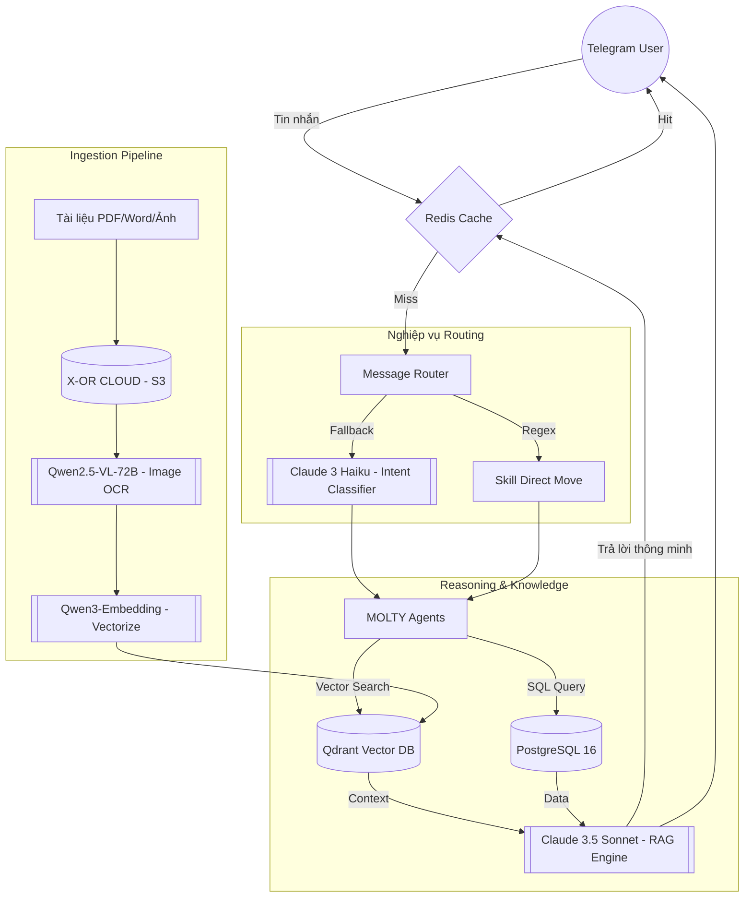

<div align="center">

# 🤖 xHR — AI-native HR Platform

**Nền tảng quản lý nhân sự thông minh nâng cường RAG cho Thinh Long Group**

[](https://python.org)
[](https://fastapi.tiangolo.com)
[](https://postgresql.org)
[](https://anthropic.com)
[](https://qdrant.tech)
[](https://redis.io)

> **5 AI agents chuyên biệt** — tự động hoá quy trình HR và quản lý tri thức (RAG) thông qua Telegram Bot, tích hợp đa mô hình AI tiên tiến: **Claude 3.5 Sonnet**, **Claude 3 Haiku**, **Qwen2.5-VL** và **Qdrant Vector DB**.

</div>

---

## 📋 Mục lục

- [Tổng quan](#-tổng-quan)
- [Kiến trúc hệ thống đa tầng](#-kiến-trúc-hệ-thống-đa-tầng)
- [🤖 5 MOLTY Agents](#-5-molty-agents)
- [🛠 AI Stack & Các mô hình AI sử dụng](#-ai-stack--các-mô-hình-ai-sử-dụng)
- [✨ Tính năng](#-tính-năng)
- [💰 Chiến lược tối ưu chi phí (Cost Efficiency)](#-chiến-lược-tối-ưu-chi-phí-cost-efficiency)
- [🚀 Cài đặt & Chạy](#-cài-đặt--chạy)
- [🔌 API Endpoints](#-api-endpoints)

---

## 🎯 Tổng quan

**xHR** là nền tảng quản lý nhân sự thế hệ mới dành riêng cho **Thinh Long Group**. Không chỉ quản lý hồ sơ nhân viên và học viên, xHR còn đóng vai trò là "Bộ não tri thức" tập trung, cho phép truy vấn dữ liệu nghiệp vụ và tài liệu pháp lý trực tiếp qua hội thoại Telegram.

---

## 🏗 Kiến trúc hệ thống đa tầng

Hệ thống được thiết kế để cân bằng giữa **Độ chính xác**, **Tốc độ** và **Chi phí**.



---

## 🤖 5 MOLTY Agents

| Agent | Phòng ban | Chuyên môn | Skills tiêu biểu |
|---|---|---|---|
| **MOLTY-NB** | `nhat_ban` | Nhật Bản | Quản lý hồ sơ LD, Pipeline tiến độ, Cảnh báo Visa/Hộ chiếu |
| **MOLTY-TV** | `thuy_en_vien` | Thuyền viên | Đơn tàu, Chứng chỉ chuyên môn, Lịch bay, RAG quy trình chủ tàu |
| **MOLTY-DT** | `dao_tao` | Trung tâm Đào tạo | Điểm danh tự động, Lịch học, Quản lý điểm học viên |
| **MOLTY-HC** | `hanh_chinh` | HC - Kế toán | Trình ký văn bản, Phí & Thanh toán, BHXH, RAG Hợp đồng LD |
| **MOLTY-CEO** | `lanh_dao` | Ban Lãnh đạo | Dashboard tổng hợp, Phân tích rủi ro, Báo cáo tài chính nhanh |

---

## 💡 Các kịch bản tương tác phổ biến

Người dùng (nhân viên) có thể tương tác với các Agent thông qua Telegram bằng ngôn ngữ tự nhiên:

### 🇯🇵 Thị trường Nhật Bản (MOLTY-NB)
*   *"Danh sách 10 hồ sơ lao động mới nhập gần nhất"*
*   *"Kiểm tra tiến độ pipeline của lao động Nguyễn Văn A"*
*   *"Cảnh báo giúp tôi những hộ chiếu nào sắp hết hạn trong 3 tháng tới"*
*   *"Báo cáo tổng quan tình hình thị trường Nhật Bản hiện tại"*

### ⚓ Crew Management (MOLTY-TV)
*   *"Tra cứu các đơn tàu đang tuyển thuyền viên gấp"*
*   *"Thuyền viên Trần Văn B đã có đủ chứng chỉ chuyên môn chưa?"*
*   *"Cho tôi xem lịch bay dự kiến của đoàn đi Hàn Quốc tuần sau"*
*   *"RAG: Quy trình thay thế thuyền viên của chủ tàu Mitsui như thế nào?"*

### 🖋️ Admin & Kế toán (MOLTY-HC)
*   *"Kiểm tra xem tôi có văn bản nào đang chờ phê duyệt không?"*
*   *"Liệt kê các khoản phí quá hạn thanh toán của các nghiệp đoàn"*
*   *"Nhắc lịch đóng BHXH tháng này"*
*   *"RAG: Theo quy định công ty, nhân viên làm việc 3 năm được hưởng bao nhiêu ngày phép?"*

### 🎓 Trung tâm Đào tạo (MOLTY-DT)
*   *"Báo cáo điểm danh lớp tiếng Nhật N4 sáng nay"*
*   *"Lịch học và phòng học của các lớp khai giảng trong tháng 3"*
*   *"Kết quả thi định kỳ của học viên lớp nguồn K25"*

### 📊 Ban Lãnh đạo (MOLTY-CEO)
*   *"Tổng doanh thu dự kiến của quý 1 là bao nhiêu?"*
*   *"Phân tích rủi ro các đơn hàng bị chậm pipeline"*
*   *"Gửi báo cáo nhanh về số lượng lao động đã xuất cảnh từ đầu năm"*

---

## 🛠 AI Stack & Các mô hình AI sử dụng

Dự án sử dụng chiến lược **Multi-LLM** để tối ưu hóa hiệu năng:

| Mô hình AI | Vai trò trong hệ thống | Lý do chọn lựa |
|---|---|---|
| **Claude 3.5 Sonnet** | **Bộ não chính (Reasoning)** | Trả lời chính xác nhất, tổng hợp RAG và viết phản hồi tiếng Việt tự nhiên. |
| **Claude 3 Haiku** | **Điều phối viên (Router)** | Tốc độ cực nhanh, giá siêu rẻ (~1/12 Sonnet) chuyên cho phân loại Intent. |
| **Qwen2.5-VL-72B** | **Thị giác máy tính (OCR)** | Khả năng đọc PDF và ảnh tài liệu (hợp đồng, bảng biểu) xuất sắc dạng Markdown. |
| **Qwen3-Embedding** | **Véc-tơ hóa tri thức** | Được tối ưu cho ngôn ngữ tiếng Việt và các văn bản nghiệp vụ phức tạp. |

---

## 💰 Chiến lược tối ưu chi phí (Cost Efficiency)

Hệ thống xHR được thiết kế để phục vụ quy mô lớn (10.000+ người) với chi phí thấp nhất:

1.  **Model Tiering (Phân cấp mô hình)**: 
    *   Sử dụng **Claude 3 Haiku** cho tác vụ định tuyến tin nhắn.
    *   Chỉ dùng **Claude 3.5 Sonnet** khi thực sự cần tư duy phức tạp hoặc tổng hợp dữ liệu RAG.
2.  **Outcome Caching (Redis)**: 
    *   Lưu trữ câu trả lời AI cho các câu hỏi trùng lặp trong 24 giờ. 
    *   **Tiết kiệm 100%** chi phí token cho các yêu cầu lặp đi lặp lại.
3.  **Prompt Caching (Native)**: 
    *   Sử dụng tính năng Caching của Anthropic cho các System Prompts dài của 5 Agents.
    *   Giảm tới **90% chi phí xử lý Input** các đoạn nội dung cố định.
4.  **Vision Optimization**: 
    *   Tự động giảm độ phân giải & nén ảnh thông minh trước khi gửi qua API OCR.
    *   Giảm **60-70% số lượng Vision Tokens** tiêu thụ.

---

## ✨ Tính năng nổi bật

- 🧠 **RAG (Retrieval-Augmented Generation)**: Chụp tài liệu và hỏi đáp trực tiếp với kho dữ liệu không cấu trúc.
- ⚡ **Real-time Alerting**: Tự động nhắc lịch qua Telegram (Hộ chiếu, Hợp đồng, BHXH).
- 📊 **Hybrid Data Access**: Kết hợp dữ liệu từ SQL (chính xác tuyệt đối) và Vector Search (linh hoạt).
- 🔒 **Security & Audit**: Phân quyền truy cập tài liệu theo phòng ban và ghi nhật ký Audit Log chi tiết.
- ⏰ **Automated Workflows**: Hệ thống tự động xử lý các tác vụ lặp lại thông qua APScheduler:
    - **Nhắc lịch**: Điểm danh (4 lần/ngày), đóng BHXH (ngày 20 hàng tháng).
    - **Cảnh báo**: Hộ chiếu/Visa hết hạn (<90 ngày), Hợp đồng hết hạn (<60 ngày).
    - **AI Email**: Tự động dùng Claude soạn và gửi email nhắc gia hạn hợp đồng cho học viên.
    - **Phê duyệt**: Nhắc trình ký tồn đọng mỗi 30 phút.
    - **Báo cáo**: Tự động gửi báo cáo tổng hợp cho Lãnh đạo vào chiều thứ Sáu.

---

## 🚀 Cài đặt & Chạy

```bash
# 1. Clone & Cấu hình môi trường
cp .env.example .env

# 2. Khởi chạy Full-stack (FastAPI, Postgres, Qdrant, Redis, PgAdmin)
docker-compose up -d --build

# 3. Migrate Database
docker-compose exec app alembic upgrade head
```

---

<div align="center">

**Built with ❤️ for Thinh Long Group**

*Powered by [Anthropic Claude](https://anthropic.com) · [Qwen AI](https://github.com/QwenLM/Qwen) · [Qdrant](https://qdrant.tech) · [Redis](https://redis.io)*

</div>
