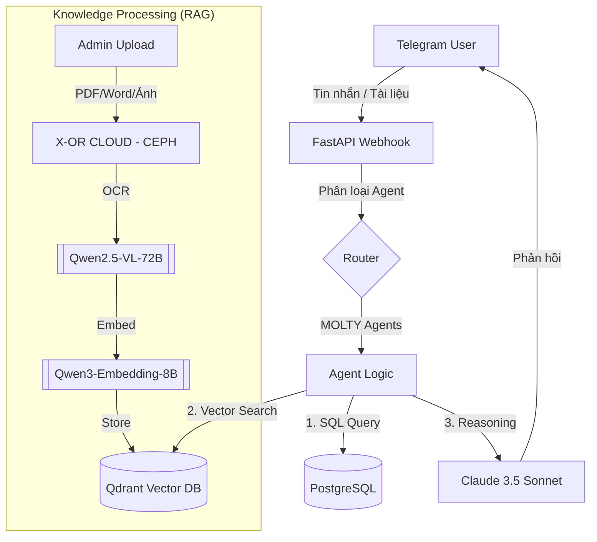

<div align="center">

# 🤖 xHR — AI-native HR Platform

**Nền tảng quản lý nhân sự thông minh nâng cường RAG cho Thinh Long Group**

[](https://python.org)
[](https://fastapi.tiangolo.com)
[](https://postgresql.org)
[](https://anthropic.com)
[](https://qdrant.tech)
[](https://core.telegram.org/bots)
[](https://docker.com)

> **5 AI agents chuyên biệt** — tự động hoá quy trình HR và quản lý tri thức (RAG) thông qua Telegram Bot, tích hợp sâu với **Qwen Vision & Embedding** và **Qdrant Vector DB**.

</div>

---

## 📋 Mục lục

- [Tổng quan](#-tổng-quan)
- [Kiến trúc hệ thống](#-kiến-trúc-hệ-thống)
- [🤖 5 MOLTY Agents](#-5-molty-agents)
- [AI Stack & Công nghệ](#-ai-stack--công-nghệ)
- [✨ Tính năng](#-tính-năng)
- [💰 Tối ưu hóa chi phí](#-tối-ưu-hóa-chi-phí)
- [🚀 Cài đặt & Chạy](#-cài-đặt--chạy)
- [🔌 API Endpoints](#-api-endpoints)
- [⏰ Tác vụ tự động](#-tác-vụ-tự-động)
- [📁 Cấu trúc dự án](#-cấu-trúc-dự-án)

---

## 🎯 Tổng quan

**xHR** là nền tảng HR AI-native được xây dựng cho **Thinh Long Group**. Hệ thống kết hợp giữa quản lý nghiệp vụ (ERP) và **Trợ lý tri thức (RAG)**. Nhân viên tương tác hoàn toàn qua Telegram để tra cứu dữ liệu có cấu trúc (SQL) và dữ liệu không cấu trúc (Hợp đồng PDF, Đơn hàng Word, Chứng từ ảnh).

### Vấn đề giải quyết

| Trước xHR | Sau xHR |
|---|---|
| Tra cứu thủ công trên Excel/Hồ sơ giấy | Truy vấn tức thì & Hỏi đáp tài liệu qua Telegram |
| Quên nhắc đóng BHXH/Hộ chiếu | Cảnh báo tự động & Chủ động nhắc lịch |
| Báo cáo mất hàng giờ | Dashboard tổng hợp thời gian thực |
| Trình ký qua email/giấy chậm | Thông báo & Phê duyệt real-time qua Telegram |

---

## 🏗 Kiến trúc hệ thống

### Luồng xử lý RAG & Message



---

## 🤖 5 MOLTY Agents

| Agent | Phòng ban | Chuyên môn | Skills tiêu biểu |
|---|---|---|---|
| **MOLTY-NB** | `nhat_ban` | Thị trường Nhật Bản | Hồ sơ LD, Pipeline tiến độ, Visa/Hộ chiếu, Báo cáo thị trường |
| **MOLTY-TV** | `thuy_en_vien`, `han_quoc` | Thuyền viên & Hàn Quốc | Đơn tàu, Hồ sơ TV, Lịch khởi hành, RAG Đơn hàng |
| **MOLTY-DT** | `dao_tao` | Trung tâm đào tạo | Điểm danh, Lịch học, Kết quả học viên, Báo cáo đào tạo |
| **MOLTY-HC** | `hanh_chinh`, `ke_toan` | Hành chính & Kế toán | Trình ký, Quản lý NV, Phí & Thanh toán, BHXH, RAG Hợp đồng |
| **MOLTY-CEO** | `lanh_dao`, `tgd` | Ban lãnh đạo | Dashboard tổng hợp, Cảnh báo rủi ro, Tài chính, Xuất khẩu |

### Ví dụ tương tác RAG
> **👤 Nhân viên:** "Đơn hàng tàu dầu đi Hàn Quốc tháng sau yêu cầu chứng chỉ gì?"
> 
> **🤖 MOLTY-TV:** "Dựa trên tài liệu đơn hàng `Don_hang_Hanquoc_03.word`, yêu cầu gồm: 1. Chứng chỉ chuyên môn tàu dầu cấp độ 2... (còn lại 3 yêu cầu khác)."

---

## 🛠 AI Stack & Công nghệ

| Thành phần | Công nghệ | Chi tiết |
|---|---|---|
| **LLM Orchestration** | `Claude 3.5 Sonnet` | Tư duy chính, phân loại intent và hội thoại |
| **Vision OCR** | `Qwen2.5-VL-72B` | Đọc hiểu tài liệu phức tạp, bảng biểu từ PDF/Ảnh |
| **Embedding** | `Qwen3-Embedding-8B` | Vector hóa tri thức tiếng Việt chuyên sâu |
| **Vector DB** | `Qdrant` | Lưu trữ vector và tìm kiếm ngữ cảnh payload-filtered |
| **Object Storage** | `X-OR CLOUD (CEPH)` | Lưu trữ tệp tin gốc ổn định chuẩn S3 |
| **Cơ sở dữ liệu** | `PostgreSQL 16` | Lưu trữ dữ liệu nghiệp vụ có cấu trúc |

---

## ✨ Tính năng

### Core & RAG
- ✅ **Hybrid Intelligence**: Kết hợp truy vấn SQL chính xác và RAG linh hoạt.
- ✅ **Vision Reasoning**: Agent "nhìn" được ảnh chứng từ để tự động trích xuất thông tin.
- ✅ **Multi-agent Routing**: Tự động dispatch theo phòng ban và quyền hạn.
- ✅ **Audit Log**: Ghi lại 100% hành động của AI agent nhằm đảm bảo an ninh.

### Tác vụ tự động (Scheduler)
- ✅ Nhắc điểm danh **4 buổi/ngày** (Phòng Đào tạo).
- ✅ Cảnh báo **Hộ chiếu/Visa** hết hạn (7:00 AM daily - ngưỡng 90 ngày).
- ✅ Cảnh báo **Hợp đồng** hết hạn (7:30 AM daily - ngưỡng 60 ngày).
- ✅ Nhắc **đóng BHXH** (Ngày 20 hàng tháng - 9:00 AM).
- ✅ Báo cáo tuần & Kiểm tra trình ký định kỳ (mỗi 30 phút).

---

## 💰 Tối ưu hóa chi phí (AI Cost Optimization)

Hệ thống được thiết kế để vận hành hiệu quả với chi phí tối thiểu thông qua các chiến lược:

- **Model Tiering**: Sử dụng **Claude 3 Haiku** cho các tác vụ phân loại Intent (tiết kiệm ~12 lần so với Sonnet).
- **Outcome Caching (Redis)**: Lưu trữ câu trả lời của AI cho các câu hỏi trùng lặp trong 24 giờ. Tiết kiệm **100% chi phí AI** cho các yêu cầu lặp lại.
- **Prompt Caching**: Kích hoạt bộ nhớ đệm (Caching) cho System Prompts và ngữ cảnh RAG dài, giảm chi phí Input Token tới 50-90%.
- **Image Optimization**: Tự động nén và resize ảnh (max 1500px) trước khi gửi qua Qwen-VL, giảm 60-70% số lượng Vision Tokens tiêu thụ.
- **Regex Fast-path**: Ưu tiên xử lý bằng mẫu định sẵn trước khi gọi LLM để tiết kiệm 100% token cho các lệnh phổ biến.

---

## 🚀 Cài đặt & Chạy

### 1. Cấu hình .env
Sao chép `.env.example` thành `.env` và điền đầy đủ các khóa API:
- `ANTHROPIC_API_KEY`, `TELEGRAM_BOT_TOKEN`, `TELEGRAM_WEBHOOK_SECRET`
- `XOR_ACCESS_KEY`, `XOR_SECRET_KEY`, `XOR_ENDPOINT_URL` (cho CEPH)
- `QWEN_API_KEY`, `QWEN_API_BASE` (cho OCR & Embedding)

### 2. Khởi động
```bash
# Xây dựng và khởi chạy toàn bộ dịch vụ (App, DB, Qdrant, PgAdmin)
docker-compose up -d --build

# Chạy migrations database
docker-compose exec app alembic upgrade head
```

---

## 🔌 API Endpoints

| Method | Endpoint | Mô tả |
|---|---|---|
| `POST` | `/admin/upload-document` | Tải tài liệu lên CEPH & Vectorize tự động |
| `POST` | `/webhook/telegram` | Nhận tin nhắn từ Telegram |
| `POST` | `/admin/register-webhook` | Thiết lập kết nối Webhook với Telegram |
| `GET` | `/docs` | Tài liệu API Swagger UI |

---

## 📁 Cấu trúc dự án

```
xhr/
├── alembic/                # Database migrations
├── src/
│   ├── main.py             # Entry point & Routes
│   ├── router.py           # Message router trung tâm
│   ├── scheduler.py        # Tác vụ định kỳ
│   ├── agents/             # 5 chuyên gia MOLTY agents
│   ├── skills/             # Kỹ năng (SQL & Search)
│   ├── integrations/       # Claude, Telegram, Qdrant, X-OR Cloud, Qwen
│   ├── database/           # Models & Session
│   └── workers/            # OCR & Document processing
└── docker-compose.yml       # Full stack orchestration
```

---

<div align="center">

**Built with ❤️ for Thinh Long Group**

*Powered by [Qwen AI](https://github.com/QwenLM/Qwen) · [Anthropic Claude](https://anthropic.com) · [Qdrant](https://qdrant.tech)*

</div>
